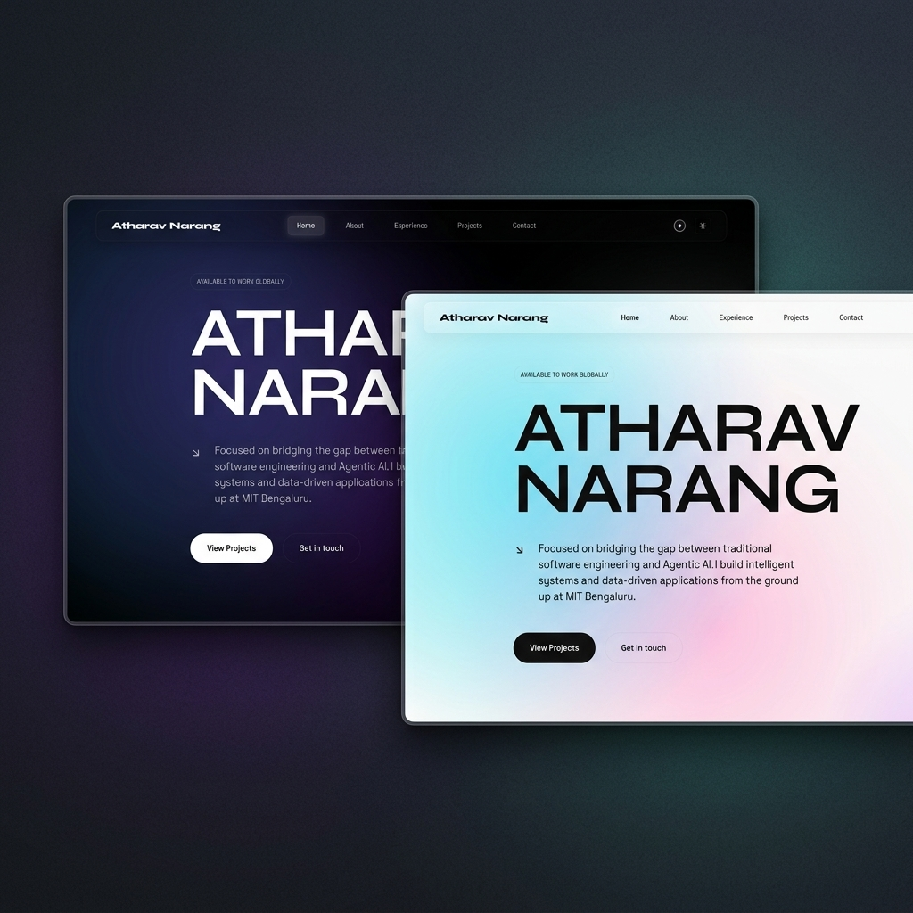
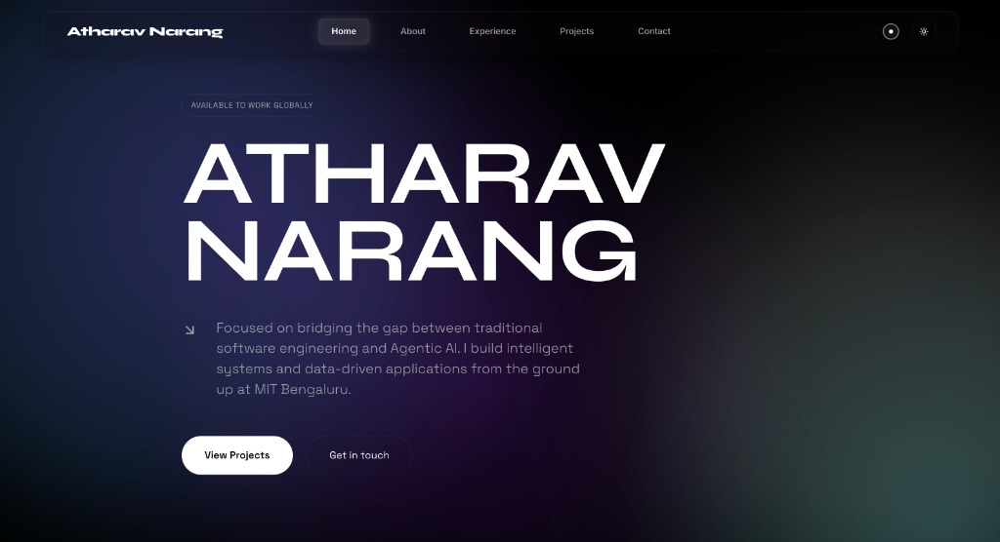
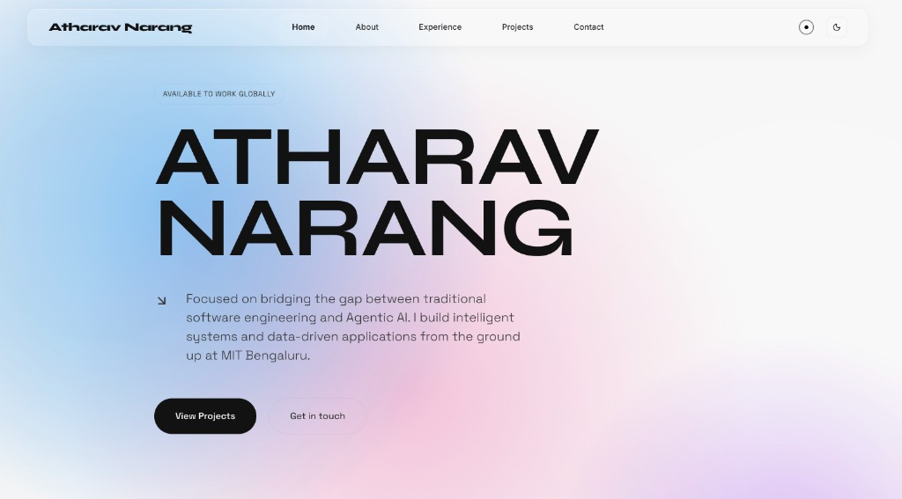

# Atharav Narang | Portfolio 2.0 🌐

> Immersive 3D & interactive software developer experience highlighting engineering expertise in Agentic AI, local LLMs, and high-performance frontend interfaces.

[](https://vitejs.dev/)
[](https://react.dev/)
[](https://www.framer.com/motion/)
[](https://developer.mozilla.org/en-US/docs/Web/CSS)
[](https://github.com/darkroomengineering/lenis)

---

## 🎨 Project Preview & Theme Modes

We support both an immersive Dark mode and a high-contrast Light mode, allowing users to toggle between two distinct premium layouts.

<p align="center">
  
</p>

### Custom Theme Showcase

| Dark Mode (Default) | Light Mode (Alternate) |
| :---: | :---: |
|  |  |

---

## ✨ Interactive Design Aesthetics & Architecture

Portfolio 2.0 is an interactive creative engineering showcase highlighting frontend design patterns and agentic AI projects:

*   **Mathematical Node Physics Background (`NeuralOrb.jsx` & `AnimatedBackground.jsx`)**: Spawns an interactive particle simulation loop using HTML5 Canvas. Elements calculate real-time proximity-based vector lines to form a fluid, reactive neural constellation.
*   **Glassmorphism Styling**: Cards utilize custom linear-gradient borders combined with `backdrop-filter: blur(20px)` panels.
*   **Kinetic Momentum Scrolling**: Integrated with [Lenis Scroll](https://github.com/darkroomengineering/lenis) for smooth momentum, coupled with scroll-driven reveal transitions (`.scroll-reveal`) utilizing active IntersectionObserver polyfills for Firefox compatibility.
*   **Slide-In Case Study Drawer (`CaseStudyViewer.jsx`)**: Responsive project inspection panels powered by Framer Motion's `AnimatePresence` and spring physics.
*   **Bespoke Custom Cursor (`CustomCursor.jsx`)**: A fluid magnetic mouse tracker that morphs, scales, and glows in response to active CTA elements on the page.
*   **WCAG AA Compliant Theme System & FOUC Prevention**: Features a dual-theme architecture with persistent theme state in `localStorage` and a blocking inline detection script to prevent Flash of Unstyled Content (FOUC). All light-theme color variables (such as the adjusted `#005fa3` primary blue) are fully optimized to guarantee contrast ratios greater than 4.5:1, meeting strict WCAG AA standards. Color swaps are smoothed out with coordinated global transitions.

---

## 🛠️ Tech Stack & Dependencies

*   **Core Framework**: React 18 / Vite (Lightning-fast HMR builds)
*   **Animation**: Framer Motion (State-driven physics transitions)
*   **Smooth Scroll**: Lenis Scroll (Linear momentum)
*   **Styling**: Pure CSS Custom Properties (Structured CSS variables)
*   **Vector Assets**: Lucide React

---

## 📂 Project Directory Breakdown

```text
├── public/
│   ├── assets/              # App case study mockup images
│   │   ├── portfolio_v2.png # Generated Portfolio 2.0 preview mockup
│   │   └── ...              # Other featured project assets
├── src/
│   ├── components/          # React layout elements
│   │   ├── NeuralOrb.jsx    # WebGL/Canvas neural-net particle engine
│   │   ├── Projects.jsx     # Main featured project lists & descriptions
│   │   ├── CaseStudyViewer  # High-fidelity project document viewer
│   │   ├── CustomCursor.jsx # Interactive magnetic mouse cursor
│   │   ├── Hero.jsx         # Splash landing text with animated titles
│   │   └── Navbar.jsx       # Smooth-linked glassmorphic nav bar
│   ├── index.css            # Global CSS variables & token architecture
│   ├── App.jsx              # App orchestration & scroll layout wrappers
│   └── main.jsx             # React DOM entry point
```

---

## 🚀 Getting Started Locally

### 1. Clone the Repository
```bash
git clone https://github.com/Atharav001/portfolio-2.0.git
cd portfolio-2.0
```

### 2. Install Project Dependencies
```bash
npm install
```

### 3. Start Development Server
Run Vite's lightning-fast local development server:
```bash
npm run dev
```

### 4. Build for Production
Create an optimized production bundle:
```bash
npm run build
```

---

## 📝 License & Attribution

Designed and engineered with passion by **Atharav Narang** (MIT Bengaluru, MAHE BLR). All rights reserved.
